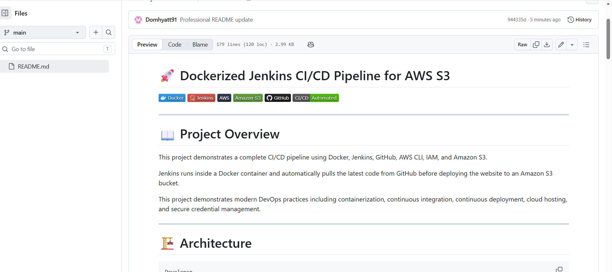
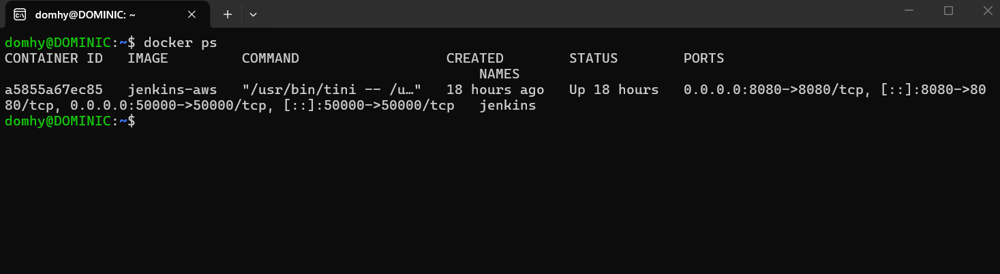
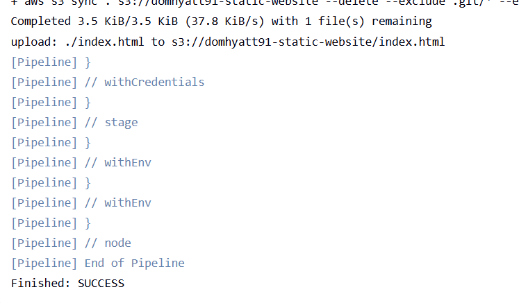
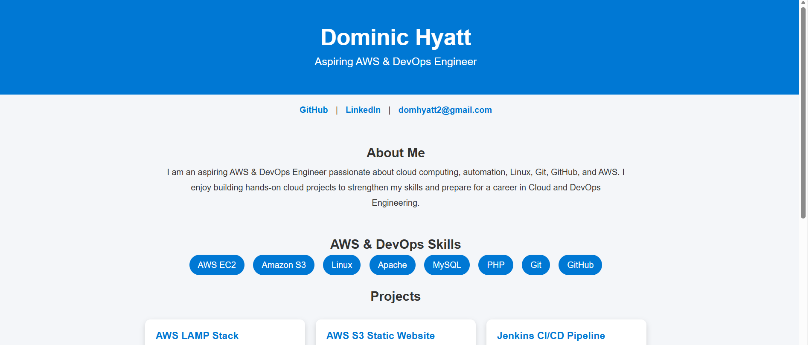

# 🚀 Dockerized Jenkins CI/CD Pipeline for AWS S3


---

# 📖 Project Overview

This project demonstrates a complete CI/CD pipeline using Docker, Jenkins, GitHub, AWS CLI, IAM, and Amazon S3.

Jenkins runs inside a Docker container and automatically pulls the latest code from GitHub before deploying the website to an Amazon S3 bucket.

This project demonstrates modern DevOps practices including containerization, continuous integration, continuous deployment, cloud hosting, and secure credential management.

---

# 🏗 Architecture

```
Developer
    │
    ▼
GitHub Repository
    │
    ▼
Jenkins Pipeline
(Running in Docker)
    │
    ▼
AWS CLI
    │
    ▼
Amazon S3 Bucket
    │
    ▼
Live Website
```

---

# ⚙ Technologies Used

- Docker
- Jenkins
- Git
- GitHub
- AWS CLI
- AWS IAM
- Amazon S3
- Linux
- CI/CD Pipeline

---

# 🚀 Features

- Jenkins running inside Docker
- GitHub source control integration
- Automated deployments
- AWS CLI integration
- Secure IAM credentials stored in Jenkins
- Continuous Deployment to Amazon S3
- Infrastructure automation workflow

---

# 📋 Pipeline Workflow

1. Developer updates website code
2. Code is pushed to GitHub
3. Jenkins pulls the latest repository
4. Jenkins authenticates with AWS
5. AWS CLI deploys website to Amazon S3
6. Website is automatically updated

---

# 📸 Screenshots

## Jenkins Dashboard



---

## Successful Pipeline Build


---

## Docker Container Running



---

## Jenkins Console Output



---

## Live AWS S3 Website



---

# 🎯 Skills Demonstrated

- Docker Containers
- Jenkins Administration
- Continuous Integration
- Continuous Deployment
- Git Version Control
- GitHub
- Linux
- AWS IAM
- AWS CLI
- Amazon S3
- DevOps Automation

---

# 📈 Results

✅ Dockerized Jenkins Server

✅ Automated Website Deployment

✅ GitHub Integration

✅ AWS Cloud Deployment

✅ Secure Credential Management

✅ End-to-End CI/CD Pipeline

---

# 🔮 Future Improvements

- GitHub Webhooks
- Terraform Infrastructure as Code
- Docker Compose
- Kubernetes Deployment
- Automated Testing
- Multi-Environment Deployments

---

# 👨‍💻 Author

**Dominic Hyatt**

Aspiring DevOps Engineer | AWS | Docker | Jenkins | Linux | CI/CD
